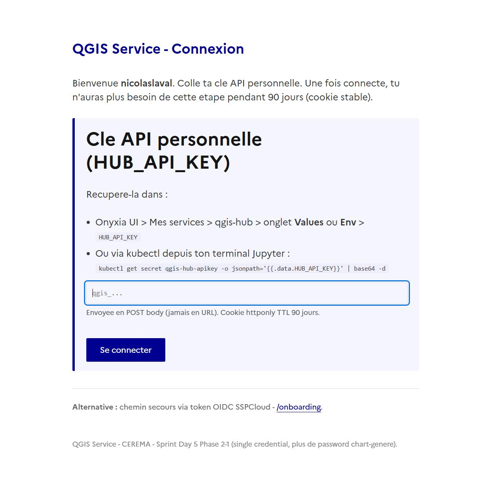
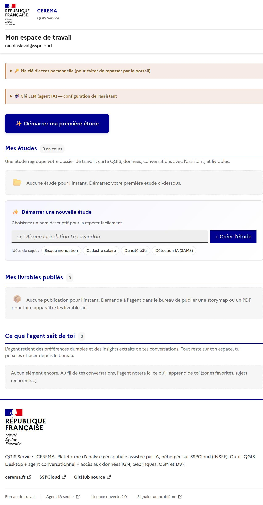
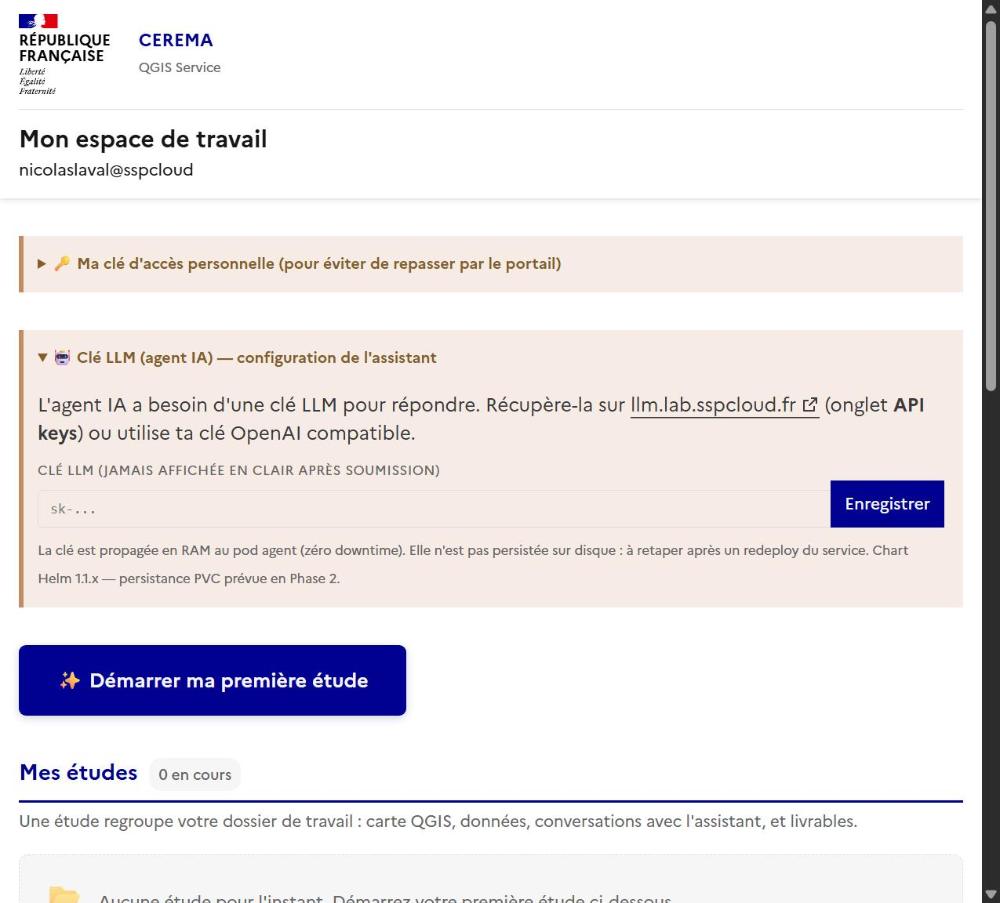
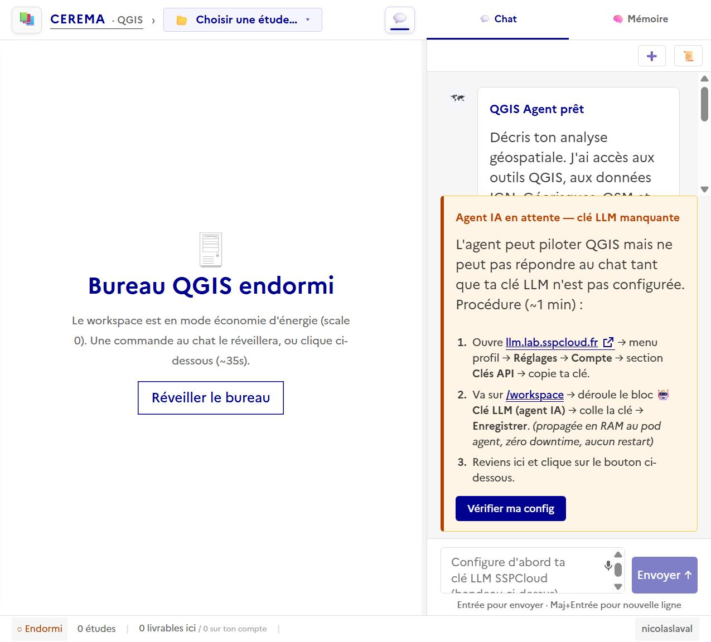

# Guide utilisateur — QGIS Hub SSPCloud

**Sprint Day 5 (2026-08-06) · chart 1.2.2 · installation user-autonome.**

Ce guide te fait passer de **zéro** (compte SSPCloud vierge, aucun service
installé) à **un bureau QGIS + agent IA opérationnel** en ~5 minutes.
Zéro admin requis, un seul credential (`HUB_API_KEY`).

Testé E2E Chrome le 2026-08-06 sur un environnement fraîchement provisionné.

---

## Prérequis

- Un compte SSPCloud actif (https://datalab.sspcloud.fr)
- Un service Jupyter démarré dans ton espace personnel avec la permission
  `kubernetes.role: edit` (défaut Onyxia depuis 2023)

C'est tout. Pas besoin de pod admin, pas besoin de token OIDC à coller.

---

## Étape 1 · Installation depuis le terminal Jupyter

Ouvre un terminal dans ton Jupyter Onyxia :
`Launcher > Other > Terminal`.

Colle le one-liner :

```bash
curl -fsSL https://raw.githubusercontent.com/nic01asFr/Qgis-sspcloud/main/install.sh | bash
```

Le script fait 5 étapes en ~90 secondes :

```
+==============================================================+
|  Installation QGIS Hub - <toi>
|  Namespace : user-<toi>
|  Domaine   : user.lab.sspcloud.fr
+==============================================================+

[1/5] Ajout du repo Helm qgis-sspcloud
[2/5] Génération values-user.yaml depuis env vars pod jupyter
[3/5] helm install/upgrade qgis-hub
[4/5] Attente démarrage pods (~90s)
  qgis-hub ready
  qgis-agent ready
  qgis-workspace-<toi> ready
[5/5] Ta cle personnelle HUB_API_KEY
```

Sortie finale (à **garder de côté**) :

```
+==============================================================+
|  Installation terminée - tes accès
+==============================================================+
|
|  URL web (bookmark) :
|    https://user-<toi>-qgis.user.lab.sspcloud.fr
|
|  Clé API personnelle (à coller dans /login) :
|    qgis_<toi>_XXXXXXXXXXXXXXXXXXXXXXXXXXXXXXXX
|
|  Configuration MCP (Claude Desktop, Cursor, Cline) :
|    https://user-<toi>-qgis.user.lab.sspcloud.fr/auth/apikey
|
|  Clé LLM (à saisir sur /workspace après 1er login) :
|    https://llm.lab.sspcloud.fr    (onglet API keys)
|
+==============================================================+
```

**Bookmark l'URL** et **copie ta clé API** (elle sera demandée à
l'étape 2). Tu peux la re-récupérer à tout moment via :

```bash
kubectl get secret qgis-hub-apikey -o jsonpath='{.data.HUB_API_KEY}' | base64 -d
```

---

## Étape 2 · Premier accès web

Ouvre l'URL dans ton navigateur. Tu es automatiquement redirigé vers
`/login` (le service détecte qu'aucun cookie n'est présent).



Colle ta clé API dans le champ, clique **Se connecter**.

Zéro exposition URL : la clé part en POST body (jamais loggée, jamais
dans l'historique navigateur, jamais dans le Referer). Un cookie httponly
`hub_api_key` TTL 90 jours est posé — tu ne repasseras plus par cette
étape pendant 3 mois, même après fermeture du navigateur.

---

## Étape 3 · Ton espace de travail

Après login, tu atterris sur `/workspace` — ton hub personnel.



Deux blocs repliables importants en haut :

- **🔑 Ma clé d'accès personnelle** — te permet de re-récupérer ta
  clé (copie-bouton) si tu changes de navigateur ou perds ton cookie.
- **🤖 Clé LLM (agent IA)** — configure l'agent IA (étape suivante).

Sous les blocs : ton dashboard études / livrables / mémoire agent
(tous vides à l'installation).

---

## Étape 4 · Configurer la clé LLM

Ouvre le bloc **🤖 Clé LLM (agent IA)** :



1. Va sur https://llm.lab.sspcloud.fr (SSO automatique)
2. Menu profil > **Réglages** > **Compte** > section **Clés API**
3. Copie une clé (crée-en une si nécessaire)
4. Reviens sur `/workspace`, colle-la dans le champ, clique **Enregistrer**

Feedback vert immédiat : "Clé LLM mise à jour (agent rechargé, zéro downtime)".

Le pod agent recharge la clé en RAM sans redémarrer — 0s d'interruption.

**Note ephemère** : cette clé survit tant que le pod agent tourne. Sur
`helm upgrade` du chart, tu devras la re-saisir. Persistance PVC prévue
en backlog.

---

## Étape 5 · Ouvrir le bureau + agent

Clique **💬 Bureau de travail** (footer) ou navigue vers `/desk`.



- **Panneau gauche** — Ressources (sources, livrables, partages)
- **Panneau central** — Canvas QGIS (endormi au 1er accès, se réveille sur commande)
- **Panneau droit** — Iframe agent IA (chat conversationnel)

Le bureau QGIS est en scale=0 pour économiser les ressources SSPCloud.
Clique **Réveiller le bureau** (~35s de démarrage) ou envoie une
commande à l'agent qui le réveillera automatiquement au besoin.

---

## Étape 6 · Configuration MCP (Claude Desktop, Cursor, Cline)

Pour connecter ton service au client MCP de ton choix :

```bash
# Depuis ton terminal Jupyter Onyxia
curl -H "Authorization: Bearer $(kubectl get secret qgis-hub-apikey \
  -o jsonpath='{.data.HUB_API_KEY}' | base64 -d)" \
  -X POST https://user-<toi>-qgis.user.lab.sspcloud.fr/auth/apikey \
  | python -m json.tool
```

Retourne un JSON prêt à copier :

```json
{
  "api_key": "qgis_<toi>_...",
  "hub_url": "https://user-<toi>-qgis.user.lab.sspcloud.fr",
  "mcp_url": "https://user-<toi>-qgis.user.lab.sspcloud.fr/mcp",
  "claude_config": {
    "mcpServers": {
      "qgis": {
        "type": "http",
        "url": "https://user-<toi>-qgis.user.lab.sspcloud.fr/mcp",
        "headers": {
          "Authorization": "Bearer qgis_<toi>_..."
        }
      }
    }
  }
}
```

Colle le bloc `claude_config` dans :

| Client | Fichier |
|---|---|
| Claude Desktop | `%APPDATA%\Claude\claude_desktop_config.json` (Windows) `~/Library/Application Support/Claude/claude_desktop_config.json` (macOS) |
| Cursor | Settings > MCP Servers |
| Cline | VS Code Settings > Cline > MCP |
| claude.ai (web, Custom Connector) | Settings > Connectors > Custom (URL + Bearer) |

Transport MCP Streamable HTTP, aucun proxy local à installer.

---

## Étape 7 · Créer ta première étude

Sur `/workspace`, tape un nom d'étude dans le champ et clique **Créer l'étude**.
Ou clique une des idées suggérées :

- Risque inondation
- Cadastre solaire
- Densité bâti
- Détection IA (SAM3)

Le hub crée le dossier étude (études sont isolées : session, projet QGIS,
recettes, livrables). Tu peux ensuite passer sur `/desk` pour travailler.

---

## Récupération / dépannage

### Perdu ta clé ?

```bash
kubectl get secret qgis-hub-apikey -n user-<toi> \
  -o jsonpath='{.data.HUB_API_KEY}' | base64 -d
```

### Réinstaller le service (garder les données)

Les PVC ont l'annotation `helm.sh/resource-policy: keep` :

```bash
helm uninstall qgis-hub -n user-<toi>
# Les PVC (data-qgis-agent-0, data-qgis-workspace-<toi>-0, qgis-hub) restent.
# Relance install.sh -> les nouveaux pods reprennent les mêmes PVC.
```

### Reset complet (perte de toutes les données étude)

```bash
helm uninstall qgis-hub -n user-<toi>
kubectl delete pvc -n user-<toi> data-qgis-agent-0 data-qgis-workspace-<toi>-0 qgis-hub
kubectl delete secret qgis-hub-apikey -n user-<toi>
# Puis relance install.sh -> nouveau Secret + nouvelle clé + PVC vierges
```

### Chemin secours (perte totale de la clé + kubectl inaccessible)

Va sur `/onboarding`, colle un id-token OIDC SSPCloud fresh (obtenu
depuis https://datalab.sspcloud.fr/account/k8sCodeSnippets, valide 24h).
Le hub validera contre Keycloak SSPCloud et posera le cookie pour toi.

---

## Retirer le service

```bash
helm uninstall qgis-hub -n user-<toi>
kubectl delete pvc -n user-<toi> data-qgis-agent-0 data-qgis-workspace-<toi>-0 qgis-hub
kubectl delete secret qgis-hub-apikey -n user-<toi>
```

---

## Bugs corrigés lors du test E2E (2026-08-06)

Ce guide a été validé sur un compte fraîchement provisionné. Trois bugs
ont été découverts et corrigés lors du parcours :

| Bug | Chart | Fix |
|---|---|---|
| `install.sh` ne passait pas les valeurs Onyxia (hostname vide → ingress 404) | 1.2.0 → 1.2.1 | `install.sh` génère `values-user.yaml` depuis env vars pod jupyter |
| Redirect racine `/` → `/onboarding` (token OIDC obscur) au lieu de `/login` | 1.2.1 → 1.2.2 | `_portal_login_redirect_url` cible `/login` (Phase 2-1 canonique) |
| Bandeau "clé LLM manquante" dans chat pointait vers `datalab.sspcloud.fr/account > AI Assistant` (portail admin retiré) | 1.2.2 | Bandeau pointe `/workspace` bloc "🤖 Clé LLM (agent IA)" (Phase 1.7-C form user) |

Chart stable actuel : **1.2.2**.

---

## Références

- QUICKSTART résumé : [QUICKSTART.md](../QUICKSTART.md)
- Architecture technique : [ARCHITECTURE.md](../ARCHITECTURE.md)
- Migration users legacy (portail nic01asfr) : [docs/day5-migration-guide.md](day5-migration-guide.md)
- Plan Sprint Day 5 : [docs/spec-day5-plan-complet.md](spec-day5-plan-complet.md)
